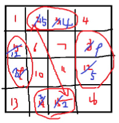

# 기타

TSP Travelling Salesman Problem 여행하는 외판원 문제

- 조합 최적화 문제
- 모든 도시를 한 번씩 방문하고 시작 도시로 돌아올 수 있는 최단거리 경로 구하기

MST
간선이 적으면 쿠르스칼
간선이 많으면 프림

A와 B의 최대공약소와 최소공배수
GCD 최대공약수
LCM 최소공약수
A * B = GCD * LCM

```python
def gcd(a, b):# 최대공약수while b > 0:
        a, b = b, a % b
    return a

def lcm(a, b):
    return a * b / gcd(a, b)
```

혹은

```python
import math

def lcm(a, b):
    return a * b / math.gcd(a, b)
```

배열 위치 이동
A[i/col][i%col] = B[i];
B[i * col + j] = A[i][j];

ConvexHull
2차원 좌표 평면에서 점들의 좌표가 주어졌을 때,
제일 큰 볼록 껍질을 구성하는 점들을 구하는 알고리즘

에라토스테네스의 체
소수 판정
냅색
유클리드 호제법
위상정렬
강한 연결 요소

# 마방진

행의 합 열의 합 대각선의 합이 모두 같은 정사각형

N * N 마방진 만드는 방법

1) N이 홀수일 때

(0, N / 2)에 1을 써 넣는다.

현재 보고 있는 y 좌표, x 좌표를 각각 -1 시킨 위치에 다음번 숫자를 써넣는다.

만일 이미 해당 칸에 숫자가 써져 있다면, 그 칸 바로 밑칸으로 이동한다.

N * N까지 다 써넣을때까지 반복한다.

2) N이 4의 배수일 때



위 그림처럼 서로 위치바꾸기